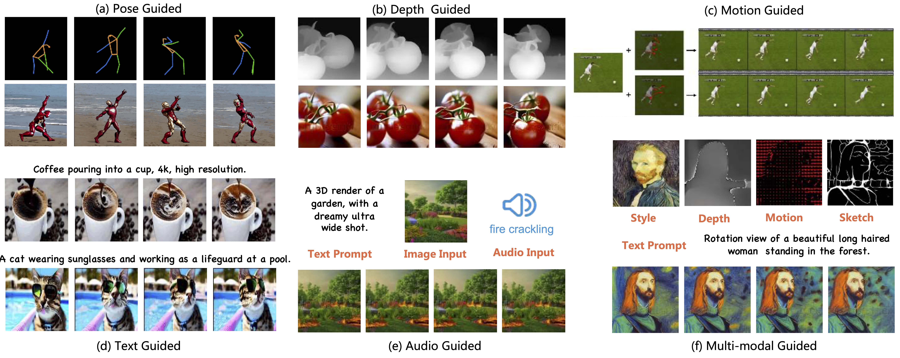
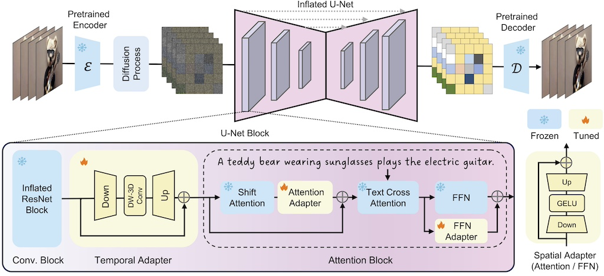
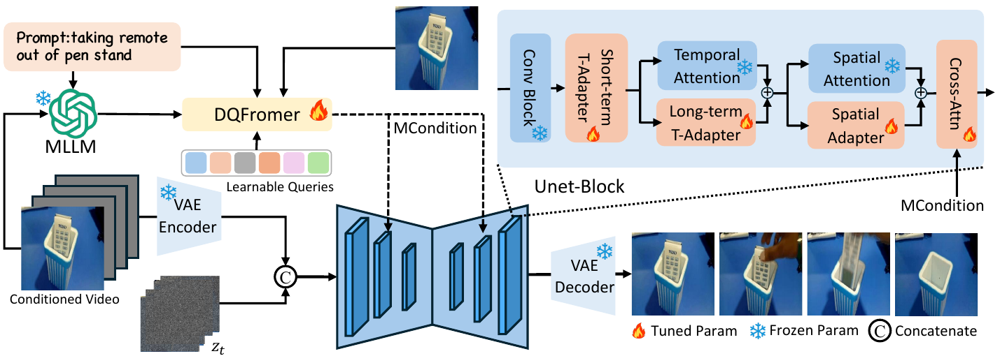
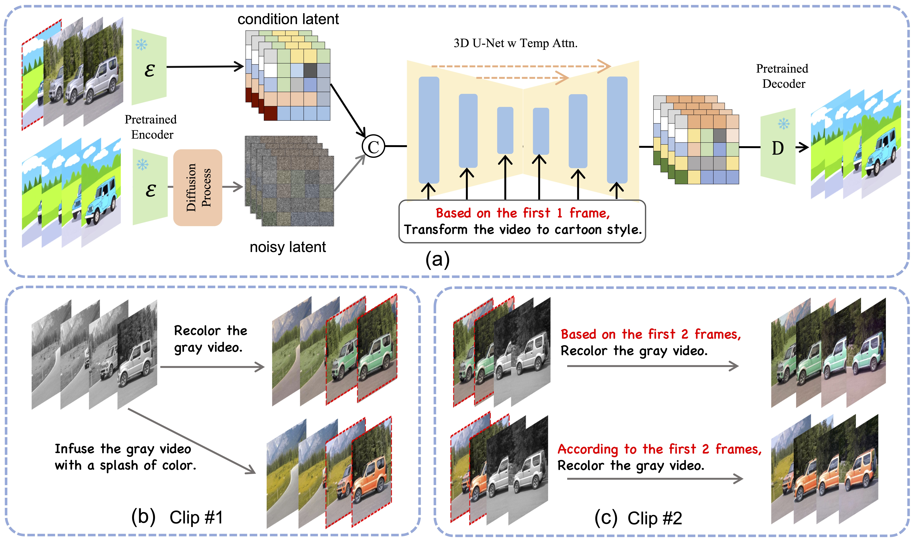
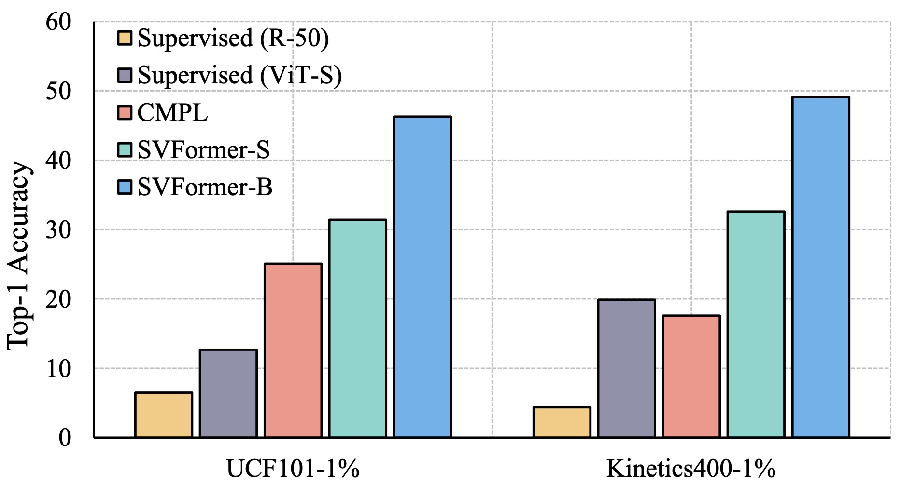
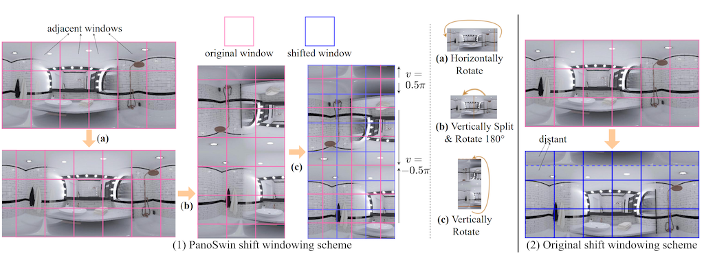
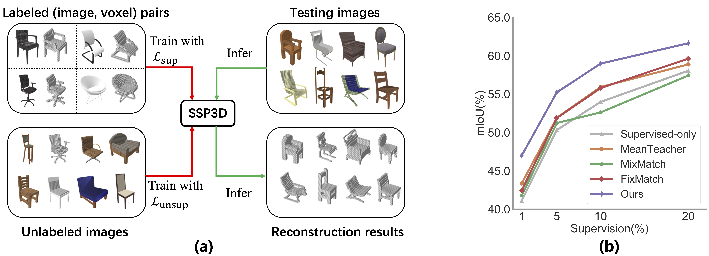
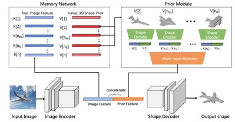
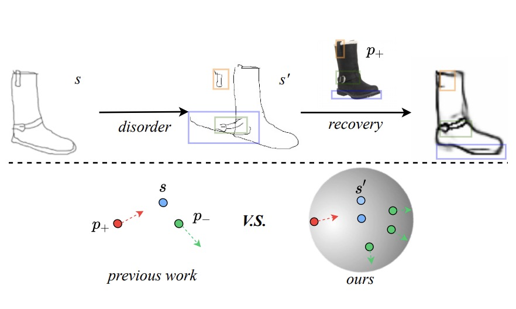

I am a Ph.D. Candidate at the School of Computer Science, [Fudan University](https://www.fudan.edu.cn/en/), where I work at [Vision and Learning Lab(FVL)](https://fvl.fudan.edu.cn/main.htm) under the supervision of Prof. [Yu-Gang Jiang](https://fvl.fudan.edu.cn/people/yugangjiang/)(IEEE Fellow) and Prof. [Zuxuan Wu](https://zxwu.azurewebsites.net/). Before this, I received my BS degree from [TianJin University](http://www.tju.edu.cn/english/index.htm).  

My research interests lie broadly in computer vision and deep learning. I mainly focus on video generation, editing and recognition. I am also open and willing to explore other vision tasks, e.g., AIGC, 3D understanding. See details about me in **[CV](/cv)**.

I am set to graduate in 2025 and am actively exploring job opportunities in both industry and academia. If you are interested in discussing potential collaborations or positions, please feel free to email me at [zhenxingfd@gmail.com](mailto:zhenxingfd@gmail.com).

<!-- Since the summer of 2022, I work under the guidance of Ph.D. [Qi Dai](https://www.microsoft.com/en-us/research/people/qid/), as a research intern in MicroSoft Research Asia([MSRA](https://www.microsoft.com/en-us/research/lab/microsoft-research-asia/)). See details about me in **[CV](/cv)** -->

News
======
* [Feb'2024] Invited talk at Openmmlab about Video Generation Models, [[slides](/VideoGenerationModel.pdf)].
* [Feb'2024] SimDA is accepted by [CVPR 2024](https://cvpr.thecvf.com/).
* [Dec'2023] Serve as a reviewer for [ICML 2024](https://icml.cc/).
* [Dec'2023] Invited talk at Kunlun Research, "A Survey on Video Diffusion Models".
* [Aug'2023] Awarded a certificate of "Star of Tomorrow" at [MSRA](https://www.microsoft.com/en-us/research/lab/microsoft-research-asia/).
* [May'2023] **One** paper is accepted by [ACL 2023](https://2023.aclweb.org/).
* [Feb'2023] **Two** papers are accepted by [CVPR 2023](https://cvpr2023.thecvf.com/).
* [July'2022] **Three** papers are accepted by [ECCV 2022](https://eccv2022.ecva.net/).
* [June'2022] **One** paper is accepted by [ACM'MM 2022](https://2022.acmmm.org/).
* [Apr'2022] **One** paper is accepted to [ACM ICMR 2022](https://www.icmr2022.org/).
* [Mar'2022] Start my internship at MicroSoft Research Asia([MSRA](https://www.microsoft.com/en-us/research/lab/microsoft-research-asia/)).
* [Jan'2022] **One** paper is accepted by [DASFAA 2022](https://www.dasfaa2022.org/).

<!-- * [Aug'2023] Invited talk at MSRA, "A Simple Diffusion Adapter for Efficient Video Generation". -->

<!-- Education
======
* B.S. in TianJin, TianJin University, 2020
* Ph.D in ShangHai, Fudan University, 2025 (expected)
* [Oct'2023] Serve as a reviewer for [CVPR 2024](https://cvpr.thecvf.com/Conferences/2024).
* [Sep'2023] Serve as a reviewer for [ICLR 2024](https://iclr.cc/).
* [Apr'2023] Serve as a reviewer for [NeurIPS 2023](https://neurips.cc/).
* [Jan'2023] Serve as a reviewer for [ICCV 2023](https://iccv2023.thecvf.com/).
* [Nov'2022] Serve as a reviewer for [CVPR 2023](https://cvpr2023.thecvf.com/).
* [May'2022] Serve as a reviewer for [ECCV 2022](https://eccv2022.ecva.net/).

Research Interest
======
* My research interests lie broadly in **Computer Vision** and **Artificial Intelligence**. My current focus majorly is to explore fundamental computer vision research with limited supervision, with a goal to conduct research and design products benefiting humanity. I am excited to be part of this fast-evolving and fascinating field, and I hope to contribute to its growth. -->

Selected Publications:
======
* See the full publication list at **[Publications](/publications)**.

<table style="width:100%"><tbody><tr><th width="30%"> </th><th style="text-align:left" width="70%"> A Survey on Video Diffusion Models  Zhen Xing, Qijun Feng, Haoran Chen, Qi Dai, Han Hu, Hang Xu, Zuxuan Wu, Yu-Gang Jiang    ACM Computing Survey (<strong>CSUR</strong>) [Minor Revision], 2023  [<a href="https://arxiv.org/abs/2310.10647">Paper</a>][<a href="https://github.com/ChenHsing/Awesome-Video-Diffusion-Models">HomePage</a>][<a href="https://zhuanlan.zhihu.com/p/661860981">Zhihu</a>]   Surveying 100+ recent literatures on video generation and editing with diffusion models.

</th>
</tr></tbody></table>

<table style="width:100%"><tbody><tr><th width="30%"> </th><th style="text-align:left" width="70%"> SimDA: A Simple Diffusion Adapter for Efficient Video Generation  Zhen Xing, Qi Dai, Han Hu, Zuxuan Wu, Yu-Gang Jiang  IEEE/CVF Conference on Computer Vision and Pattern Recognition (<strong>CVPR</strong>), 2024   [<a href="https://arxiv.org/abs/2308.09710">Paper</a>][<a href="https://chenhsing.github.io/SimDA/">HomePage</a>]
</th></tr></tbody></table>

<table style="width:100%"><tbody><tr><th width="30%"> </th><th style="text-align:left" width="70%"> AID: Adapting Image2Video Diffusion Models for Instruction-based Video Prediction  Zhen Xing, Qi Dai, Zejia Weng, Zuxuan Wu, Yu-Gang Jiang  Technique Report, 2024   [<a href="https://arxiv.org/abs/2406.06465">Paper</a>][<a href="https://chenhsing.github.io/AID/">HomePage</a>]
</th></tr></tbody></table>

<table style="width:100%"><tbody><tr><th width="30%"> </th><th style="text-align:left" width="70%"> VIDiff: Translating Videos via Multi-Modal Instructions with Diffusion Models  Zhen Xing, Qi Dai, Zihao Zhang, Hui Zhang, Han Hu, Zuxuan Wu, Yu-Gang Jiang  arXiv preprint, 2023   [<a href="https://arxiv.org/abs/2311.18837">Paper</a>][<a href="https://chenhsing.github.io/VIDiff/">HomePage</a>][<a href="https://zhuanlan.zhihu.com/p/670615911">Zhihu</a>]
</th></tr></tbody></table>

<table style="width:100%"><tbody><tr><th width="30%"> </th><th style="text-align:left" width="70%"> SVFormer: Semi-supervised Video Transformer for Action Recognition   Zhen Xing, Qi Dai, Han Hu, Jingjing Chen, Zuxuan Wu, Yu-Gang Jiang  IEEE/CVF Conference on Computer Vision and Pattern Recognition (<strong>CVPR</strong>), 2023   [<a href="https://arxiv.org/abs/2211.13222">Paper</a>][<a href="https://github.com/ChenHsing/SVFormer">Code</a>]
</th></tr></tbody></table>

<table style="width:100%"><tbody><tr><th width="30%"> </th><th style="text-align:left" width="70%"> PanoSwin: a Pano-style Swin Transformer for Panorama Understanding   Zhixin Ling, Zhen Xing, Manliang Cao, Xiangdong Zhou  IEEE/CVF Conference on Computer Vision and Pattern Recognition (<strong>CVPR</strong>), 2023   [<a href="https://openaccess.thecvf.com/content/CVPR2023/papers/Ling_PanoSwin_A_Pano-Style_Swin_Transformer_for_Panorama_Understanding_CVPR_2023_paper.pdf">Paper</a>][<a href="https://github.com/1069066484/PanoSwinTransformerObjectDetection">Code</a>]
</th></tr></tbody></table>

<table style="width:100%"><tbody><tr><th width="30%"> </th><th style="text-align:left" width="70%"> Semi-supervised Single-view 3D Reconstruction via Prototype Shape Priors   Zhen Xing, Hengduo Li, Zuxuan Wu, Yu-Gang Jiang  European Conference on Computer Vision (<strong>ECCV</strong>), 2022   [<a href="https://arxiv.org/abs/2209.15383">Paper</a>][<a href="https://github.com/ChenHsing/SSP3D">Code</a>]
</th></tr></tbody></table>

<table style="width:100%"><tbody><tr><th width="30%"> </th><th style="text-align:left" width="70%"> Few-shot Single-view 3D Reconstruction with Memory Prior Contrastive Network   Zhen Xing, Yijiang Chen, Zhixin Ling, Xiangdong Zhou, Yu Xiang  European Conference on Computer Vision (<strong>ECCV</strong>), 2022   [<a href="https://arxiv.org/abs/2208.00183">Paper</a>][<a href="#">Code</a>]
</th></tr></tbody></table>

<table style="width:100%"><tbody><tr><th width="30%"> </th><th style="text-align:left" width="70%"> Conditional Stroke Recovery for Fine-Grained Sketch-Based Image Retrieval   Zhixin Ling, Zhen Xing,Jian Zhou, Xiangdong Zhou  European Conference on Computer Vision (<strong>ECCV</strong>), 2022   [<a href="https://www.ecva.net/papers/eccv_2022/papers_ECCV/papers/136860708.pdf">Paper</a>][<a href="https://github.com/1069066484/CSR-ECCV2022">Code</a>]
</th></tr></tbody></table>

<!-- Honors & Awards
======
* Tencent academic scholarship. (**Rank 1/130, PhD**) [2022]
* Fudan University excellent academic scholarship. (**Top-5%, Master**) [2021]
* CCKS 2021 National knowledge graph and semantic computing competition (**Rank 6/431**). [2021]
* MangoTV International audio and video algorithm competition (**Rank 6/193**). [2021]
* Outstanding graduates of TianJin University. (**Top-5%**) [2020]
* Second prize of virtual scene group of automatic driving challenge of International Intelligent Conference. [2019]
* Excellent monitor of Tianjin University. (**Top-10**) [2018]
* Academic scholarship of Tianjin University. (**Top-10%**) [2017-2020]

Work experience
======
* Mar. 2022- Now: Research Intern
  * MicroSoft Research Asia, Visual Computing
  * Duties included:  Video Action Recognition, Self/Semi Supervised Learning
  * Supervisor: Qi Dai, Han Hu

* Apr. 2019 - July. 2019: Algorithm Engineer Intern
  * China Automotic Technology and Research Center
  * Duties included: Object Detection, Path Planning

Service
======
* Conference Reviewer: **CVPR**(2022-2023), **ICCV**(2023), **NeurIPS**(2023), **ECCV**(2022), **AAAI**(2022-2023), **MM**(2022)
* Teaching Assistant: Digital Image Processing, Computer Image Technology in Fudan University
   -->